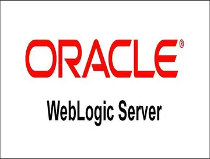
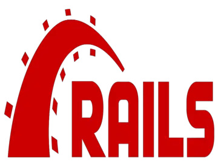

# Deliverable 1

## Basic Terminology

### What is a web server? 

The term webserver can refer to either hardware or software or both of them working together.

- For the hardware side, a web server is a computer that stores web server software and a website's component files (HTML documents, images, CSS stylesheets, and JavaScript files). A web server connects to the Internet and supports physical data interchange with other devices connected to the web.

- For the software side, a web server includes parts that control how web users access hosted files. At a minimum, this is an HTTP server. An HTTP server is software that understands URLS and HTTP. An HTTP server can be accessed through the domain names of the websites it stores, and it delivers the content of these hosted websites to the end user's device.

### What are some different web server applications?

| Application Name | license            | Project's Website                      |
| ---------------- | ------------------ | -------------------------------------- |
| Apache TomEE     | Apache License 2.0 | [Apache TomEE](https://tomee.apache.org/) |
| Oracle WebLogic  | Proprietary        | [Oracle WebLogic](https://cis106.com)        |
| Ruby on Rails    | MIT license        | [Ruby on Rails](https://rubyonrails.org/)  |

#### Example 1

Apache TomEE is an all-Apache certified application server that extends Apache Tomcat that is assembled from a vanilla Apache Tomcat zip  file.

#### Example 2

Oracle WebLogic is a unified and extensible platform for developing, deploying and running enterprise applications, such as Java, for on-premises and in the cloud.

#### Example 3

Ruby on Rails is a web-app framework that includes everything needed to create database-backed web applications.

### What is virtualization?

Virtualization is defined as creating virtual versions of something. Virtualization is often used to let multiple OSs run on one physical machine at the same time. Virtualization allows administrators to divide the hardware and create multiple computers inside a single physical computer.

### What is virtualbox? 

Oracle VM VirtualBox is a type-2 hypervisor that allows the user to extend their existing computer to run multiple operating systems including Microsoft Windows, MAC OS X, Linux, and Oracle Solaris, at the same time.

### What is a virtual machine?

A virtual machine is a computer system created using software on one physical computer to emulate the functionality of another separate physical computer.

### What is Ubuntu Server?

Ubuntu Server is a part of the larger set of Ubuntu products and operating system developed by Canonical Ltd. Ubuntu server is a specific addition that is used to facilitate installation on servers.

### What is a firewall?

A firewall is a network security system that monitors and controls incoming and outgoing network traffic based on predetermined security rules. A firewall establishes a barrier between a trusted network and an untrusted network.

### What is SSH?

SSH, known as Secure Shell or Secure Socket Shell, is a network protocol that gives users, system administrators, a secure way to access a computer over an unsecured network. SSH also refers to the suite of utilities that implement the SSH protocol such as strong password authentication and public key authentication.

## Important Concepts  

**Systemmd** - is a command that is used to manage system settings and services. Systemd organizes tasks into components called units, and groups of units into targets that can be used to create dependencies on other system services and resources.

**Systemctl** - is a command that is used to interact with processes that are controlled by systemd. It can be used to examine the status of units and targets, as well as start, stop, and reconfigure them.

