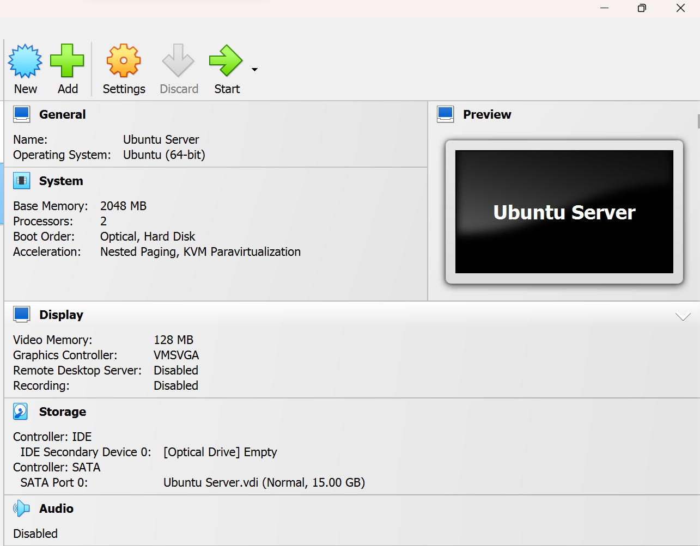
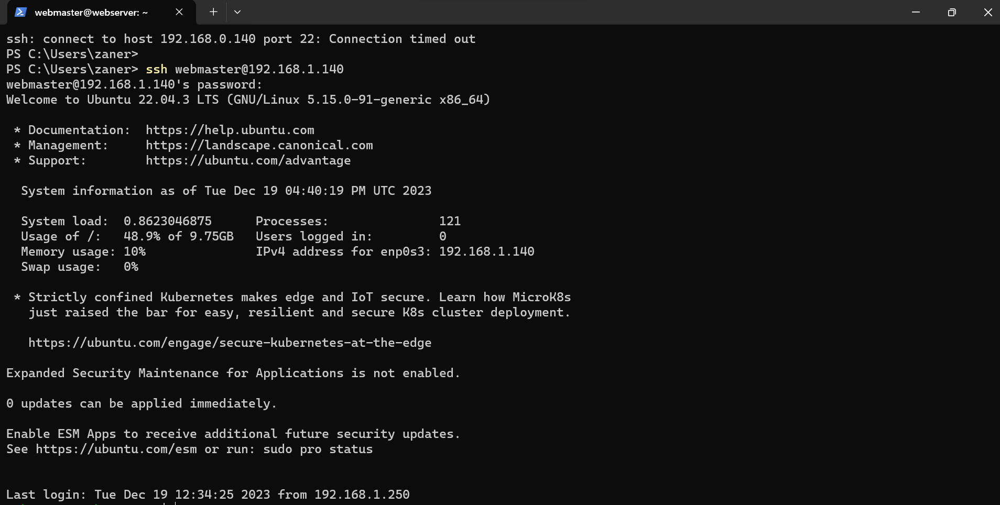
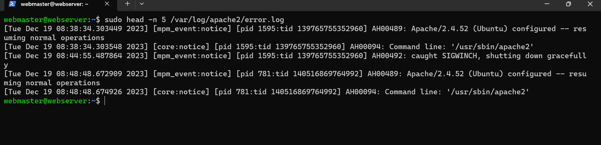
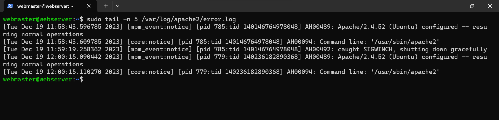
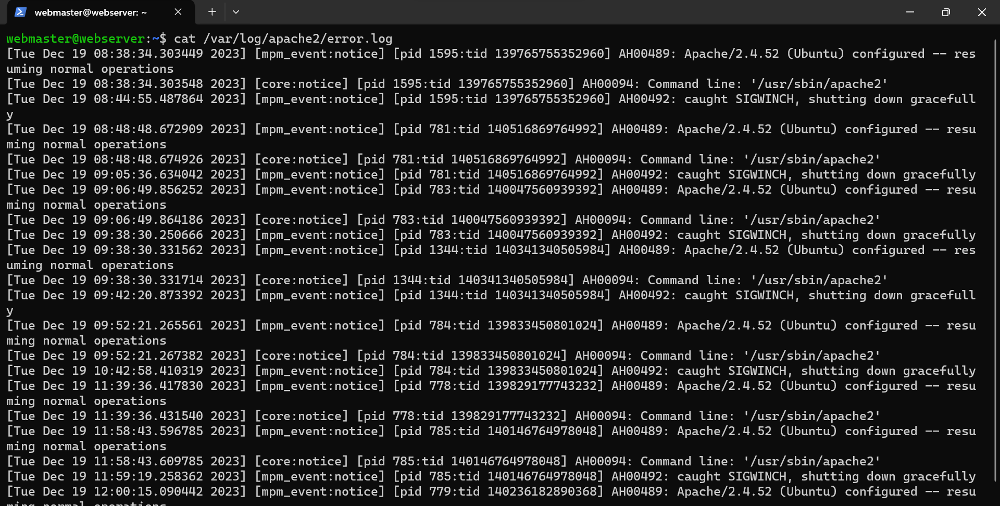

# Deliverable 2 Submission

## Server Specifications

## Ubuntu Login Screen

## Questions
3. **What is the IP address of your Ubuntu Server Virtual Machine?**
    - The IP address of the Ubuntu Server is : 192.168.1.140.
   
4. **How do you enable the Ubuntu Firewall?**
    - To enable the Ubuntu Firewall use the following command: 'sudu ufw enable'.
   
5. **How do you check if the Ubuntu Firewall is running?**
    - To check the if the Ubuntu Firewall is running use the following command: 'sudu ufw status'.
   
6. **How do you disable the Ubuntu Firewall?**
    - To disable the Ubuntu Firewall use the following the command: 'sudu ufw disable'.
   
7. **How do you add Apache to the Firewall?** 
    - To add Apache to the Firewall use the following command: 'sudo ufw allow 'Apache''.
   
8. **What is the command you used to install Apache?**
    - To install Apache use the following command: 'sudo apt install apache2 -y'.
   
9.  **What is the command you use to check if Apache is running?**
    - To check if Apache is running use the following command: 'systemctl status apache2 --no-pager'.
    
10. **What is the command you use to stop Apache?**
    - To stop Apache use the following command: 'sudo systemctl stop apache2'.

11. **What is the command you use to restart Apache?**
    - To restart Apache use the following command: 'sudo systemctl restart apache2'.
    
12. **What is the command used to test Apache configuration?**
    - To test Apache configuration use the following command: 'sudo apache2ctl configtest'.
    
13. **What is the command used to check the installed version of Apache?**
    - To check the installed version of Apache use the following command: 'sudo apache2 -v'.
    
14. **What are the most common commands to troubleshoot Apache errors? Provide a brief description of each command.**
    - The most command commands to troubleshoot Apache errors are: 
        - Systemctl - used to control and interact with Linux services via the systemd service manager.
        - Journalctl - used to query and view the logs that are generated by systemd.
        - Apachectl - when troubleshooting, this command is used to check Apache's configuration.
    
15. **Which are Apache Log Files, and what are they used for? Provide examples and screenshots.**
    - Apache log files are a help resource for troubleshooting as any error that you receive in a browser or other HTTP client will have a corresponding entry in Apache's logs. Apache will also output errors related to configuration, built-in modules, and other debugging information to its log files.
    
    

    

    

