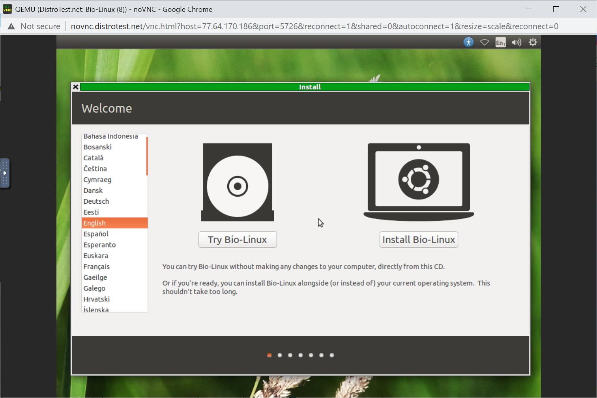
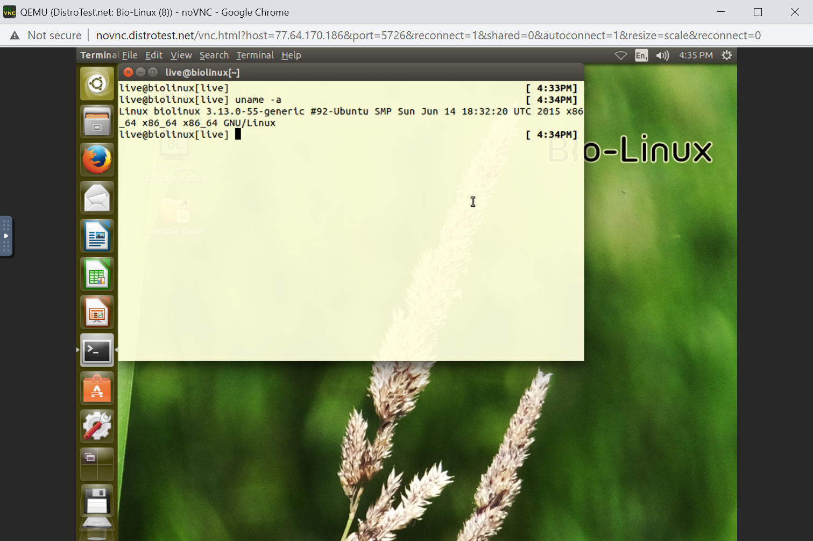
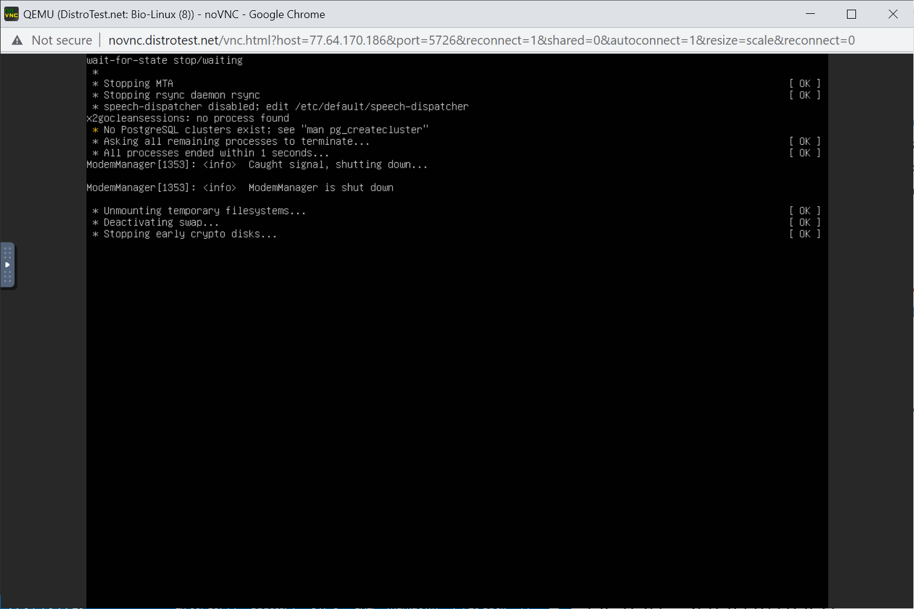

# Lab 1 Exploring Linux distributions

## Question 1
1. What is the OS Type: **Linux**
2. Which major distro is it based on? **Debian**
3. Which processor architecture does it support? **armhf, ppc64el, riscv, s390x, x86_64**
4. Is the distribution active or is it discontinued? **Active**
5. What is the distro’s home page? **https://www.ubuntu.com/**

## Question 2
1. What is the name of the distribution and the OS Type: **Name is CloudReady. OS Type is Linux.**
2. Which major distro is it based on? **Gentoo**
3. Which processor architecture does it support? **x86_64**
4. Is the distribution active or is it discontinued? **Active**
5. What is the distro’s home page? 	**https://www.neverware.com/**

## Question 3
1. What is the name of the distribution? **EndeavourOS**
2. What is the country of Origin? **Netherlands**
3. What major distribution is it based on? **Arch**
4. What is the distribution category? **Desktop, Live Medium**
5. Which processor architecture, aside from the one in the original query, does the OS support? **aarch64**

## Question 4
### A Linux distribution used for Data Rescue/Data recovery

| Distro name | Website | Desktop Environment |
|-------------|---------|---------------------|
| Kali Linux  | http://www.kali.org/ | Enlightenment, GNOME, KDE Plasma, LXDE, MATE, Xfce |

### A Linux distribution used for Education that supports the ix86 processor architecture.

| Distro name | Website | Desktop Environment |
|-------------|---------|---------------------|
| Nix Os | 	http://nixos.org/ | Awesome, Enlightenment, Fluxbox, GNOME, i3, IceWM, KDE Plasma, Ratpoison, Xfce |

### A Linux distribution that supports the OEM installation method

| Distro name | Website | Desktop Environment |
|-------------|---------|---------------------|
| Linux Mint | https://linuxmint.com/ | Cinnamon, MATE, Xfce |

## Question 5

**PredatorOS is *"a security-centric free open-source Linux project for penetration testing and ethical hacking and also you can use it as: privacy, hardened, secure, anonymized linux distro"* . A operating system that can be used for the various stated before is pretty interesting and fascinating. Especially in a time where companies are trying more and more to collect as much information about you, privacy on the internet is more important than ever.**

## Question 6

