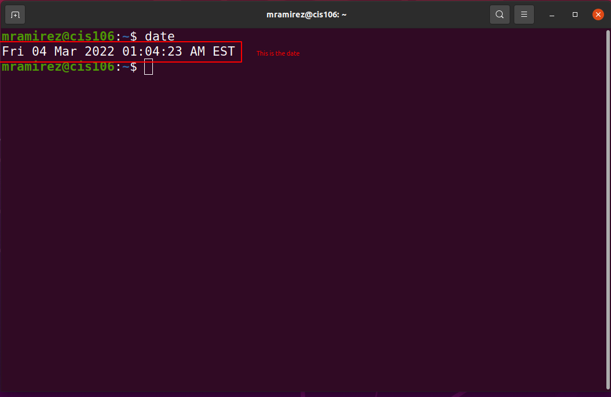
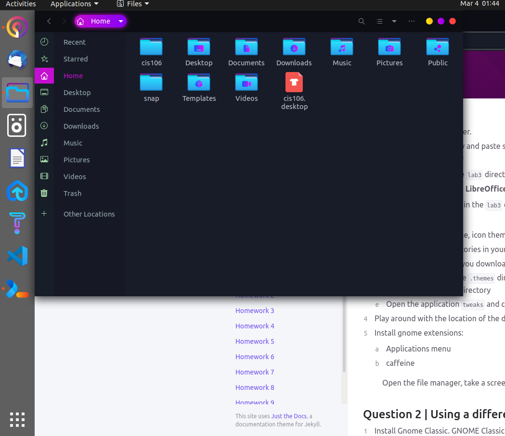
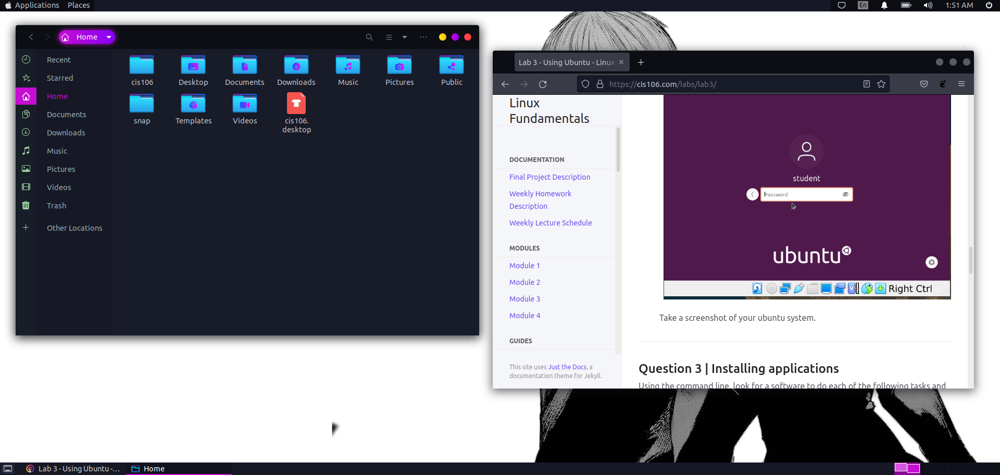

# Lab 3 Using Ubuntu

# Question 1

# Question 2

# Question 3

| Program purpose     | Package Name | Version | Description |
| ------------------- | ------------ | ------- | ----------- |
| Play a tetris game  | Quadrapassel | 1:3.36.0-1 | popular Russian game, similar to Tetris |
| Play a video file   | VLC | 3.0.9.2-1 | multimedia player and streamer |
| Browse the internet | Falkon | 3.1.0-0 | lightweight web browser based on Qt WebEngine |
| Read your email     | Thunderbird | 1:91.5.0 | Email, RSS and newsgroup client with integrated spam filter |
| Play music          | xmms2 | 0.8 | Client/server based media player system |

Commands Answers:
* Sub Question 1: 'sudo apt install quadrapassel vlc falkon thunderbird xmns2 -y'
* Sub Question 2: 'sudo apt remove quadrapassel vlc falkon thunderbird xmns2 -y'
* Sub Question 3: 'sudo apt install quadrapassel+ vlc+ falkon- thunderbird- xmns2- -y'

# Question 4

| command | what it does |
|---------|--------------|
| echo    | display a line of text |
| fortune | print a random, hopefully interesting, adage |
| cowsay  | configurable speaking/thinking cow (and a bit more) |
| lolcat  | rainbow coloring for text |
| figlet  | display large characters made up of ordinary screen characters |
| toilet  | display large colourful characters |
| rig     | Random Identity Generator |