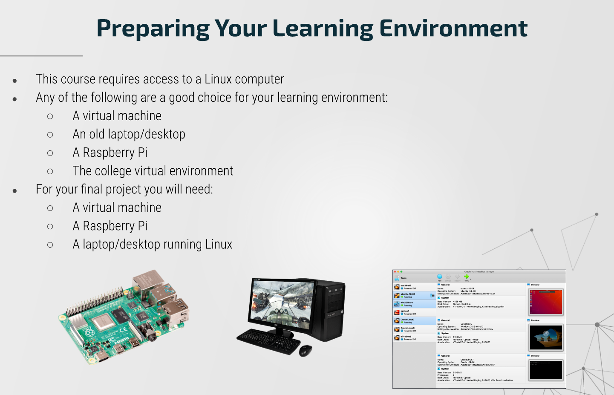
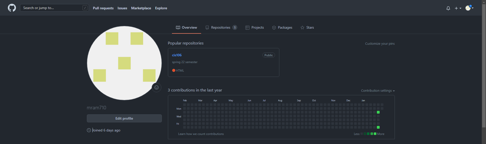

# Week Report 0
## Summary of Presentation: Introduction to CIS 106

### The presentation give us reasons as to why we should learn about linux. 
* Linux is the Global Operation System that runs everywhere - servers, personal computers, smartphones, and embedded devices. 
* It is a required skill by most Information Technology, Computer Science, and Information Systems careers.
* Linux is a open source/free software which means that you can read/improve/distribute source code, you can customize every part of it, and it respects your privacy. 
* Since it is open source, it has a huge number of developers, thus leading vulnerabilities to being patched fast.
*  Linux is one of the most stable operating systems in the planet; linux servers are known to run for years without needing a single reboot. 

### Learning Environment

## My github account

## Final Project Research: Pick a project

* Host a simple website in Ubuntu Server using Apache/NGINX 🌟
* Build a file server with Ubuntu Server or Debian 🌟🌟
* Build a portable Hacking Machine with a Raspberry Pi and Kali Linux 🌟