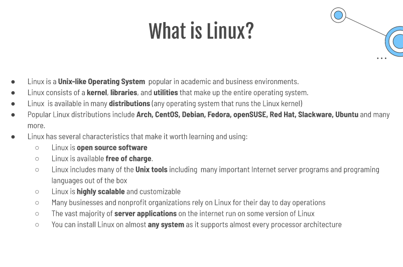
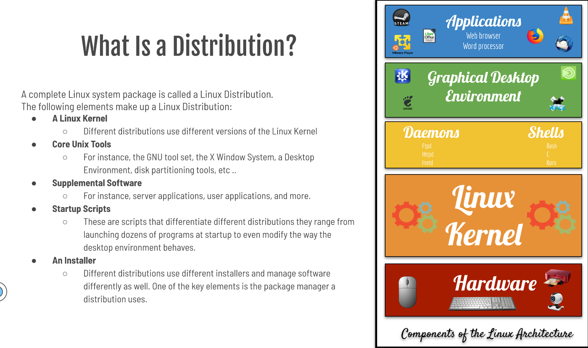
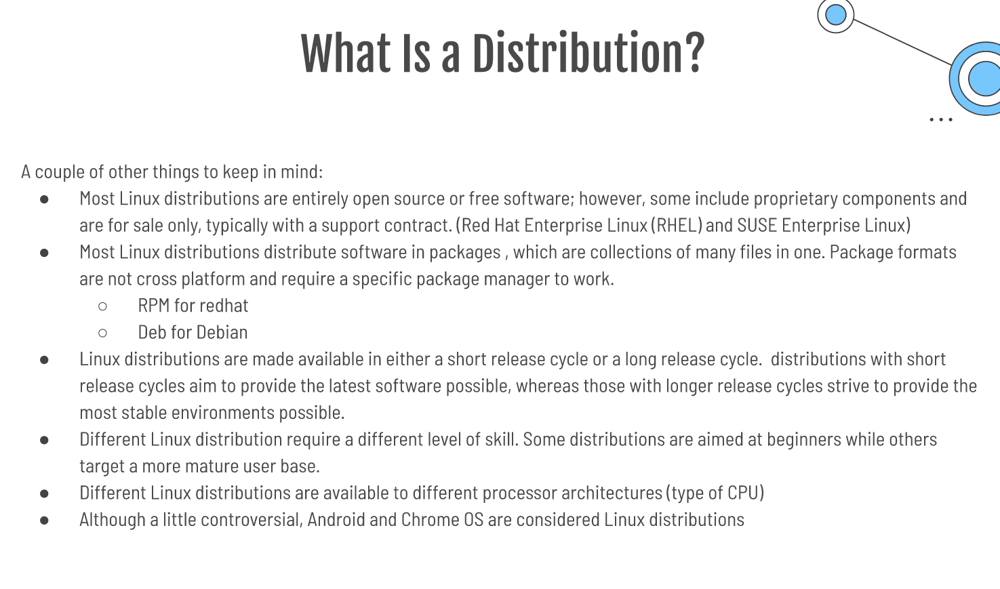
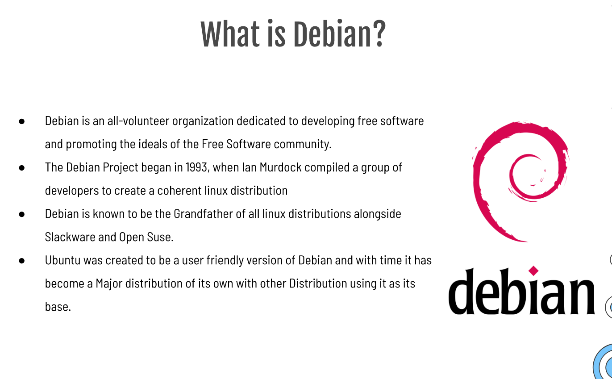
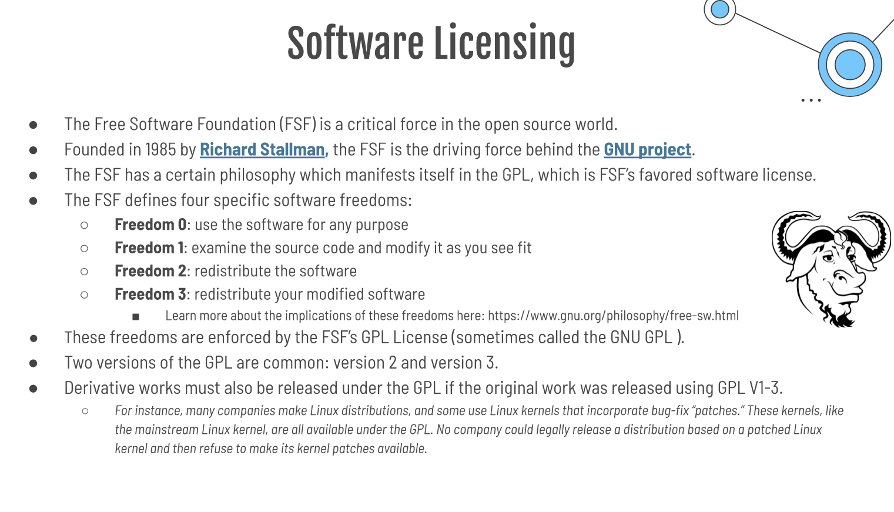
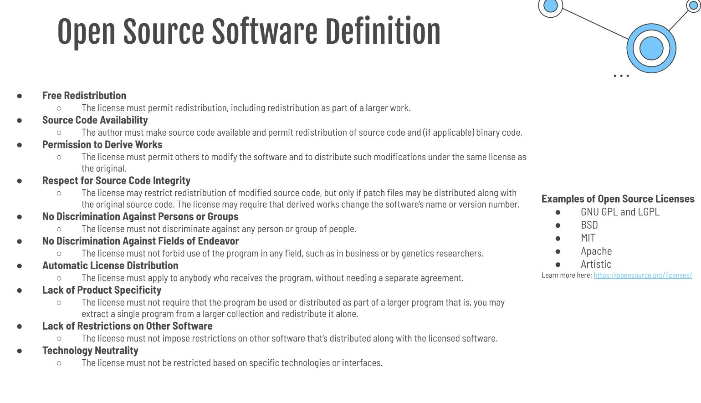

# Week Report 1
## Summary of Presentation: Introduction to Linux

### What is an operating system?

* An operating system provides all fundamental software features of a computer.
* An OS enables you to use the computer's hardware providing you the basic tools that make the computer useful.
* All of the those features relay on the OS's kernel.
* Other OS features are owed to additional programs that run atop the kernel.

### What is a kernel?

* An OS kernel is a software component that's responsible for managing low-level features of the computer, including the following managing system hardware, memory allocation, CPU time, and program to program interaction.

### What is Linux?

### What is a Distribution?

### What is Ubuntu?

* Ubuntu is a Linux distribution, freely available with both community and professional support.
* The Ubuntu community is built on the ideas enshrined in the Ubuntu Manifesto.
  * The software should be available free of charge
  * The software tools should be usable by people in their local language and despite any disabilities
  * People should have the freedom to customize and alter their software in whatever way they see fit

### What is Debian?

### Software Licensing

* Software is a type of intellectual property that is governed by copyright laws and , in some countries, patent laws.
* Open source software, however, relies on licenses, which are documents that alter the terms under which the software is released.
* Types of licensing agreement:
  * Open Source: the software may be distributed for a fee or free. The source code is distributed with the software.
  * Closed Source: the software is not distributed with the source code. The user is restricted from modifying the code.
    * Freeware: the software is free but source code is not available.
    * Shareware: the software is free on a trial basis.
  * Free software: the software is distributed with the source code. The software can be free of charge or obtained by a fee.

# The Open Source Initiative

* Founded by Bruce Perens and Eric S. Raymond founded the Open Source Initiative (OSI) in 1998 as an umbrella organization for open source software in general.
* Its philosophy is similar to that of the FSF but differs in some important details: 
  * As a general rule, more software qualifies as open source than qualifies as free 
  * During the 80s and 90s, the free software movement became popular in the academia and hobbyists groups.
  * Businesses, however, were not adopting free software due to misunderstanding of what free software means.
  * The FSF's advocacy efforts were (and are) based on a strong moral imperative software: should be free
* OSI Mission Statement:
  *  Open source is a development method for software that harnesses the power of distributed peer review and transparency of process. The promise of open source is better quality, higher reliability, more flexibility, lower cost, and an end to predatory vendor lock-in.

# How does open source make money?

* Services and Support: The product can be open source, and even given away for free, while the company sells services and support.
* Dual Licensing: A company can create two version of the product - one version is completely open source, and another adds features that are no available in the open source version.
* Multiple Products: The open source product may be just one offering from the company, with revenue being generated by other product lines.
* Open Source Drives: A special case of the preceding one is that of hardware vendors. They might opt to release drivers, or perhaps even hardware-specific applications, as open source as a way to promote their hardware.
* Bounties: Bounties are crowdfunding method. Users can drive open source creation by offering to pay for new software or new features in existing software.
* Donations: Many open source projects accept donations to help fund development.

## Final Project Research Questions and answers

## What is the problem that you are trying to solve with this project?

* The problem that I am trying to solve with this project is to host a simple website in Ubuntu server using Apache/NGINX.

## What are the names of the technologies involved?
	
  * Ubuntu Server is a server operating system that was developed by Canonical. Ubuntu Server works with nearly any hardware or virtualization platform. IT can serve up websites, file shares, and containers.Ubuntu server runs on all major architectures: x86, x86-64, ARM v7, ARM64, POWER8, and IBM System z mainframes via LinuxONE. Ubuntu is a server platform that anyone can use for websites, FTP, email servers, file and print servers, development platform, container deployment, cloud services, and database servers.

  * NGINX (pronounced as Engine-X) is a free and open-source web server software, load balancer, and reverse proxy optimized for very high performance and suability. It also offers low memory usage and high concurrency--which is why it is the preferred web server for powering-high traffic websites.

  * Apache is a open source web server that's available for Linux servers free of charge. It provides many power features that includes dynamically loadable modules, robust media support, and extensive integration with other popular software.
    
## What are the system requirements for the project?

* The minimum system requirements for Ubuntu Server are stated as: RAM: 512MB, CPU: 1 GHz, and Storage: 1GB disk (1.75GB for all features to be installed)
* The system requirements to install Nginx is a computer running Ubuntu Server 16.04 and basic knowledge of command line use.
* The system requirements to install Apache is a computer running Ubuntu Server 16.04, Secure Shell (SSH) access to your server and basic Linux command line knowledge

    