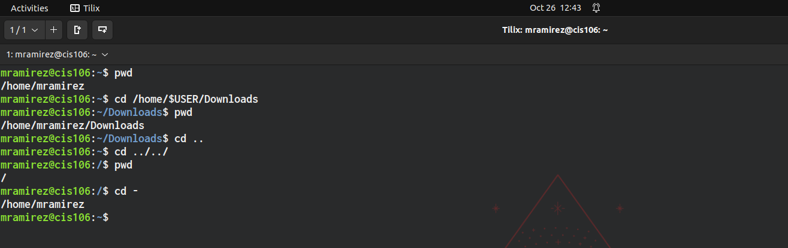
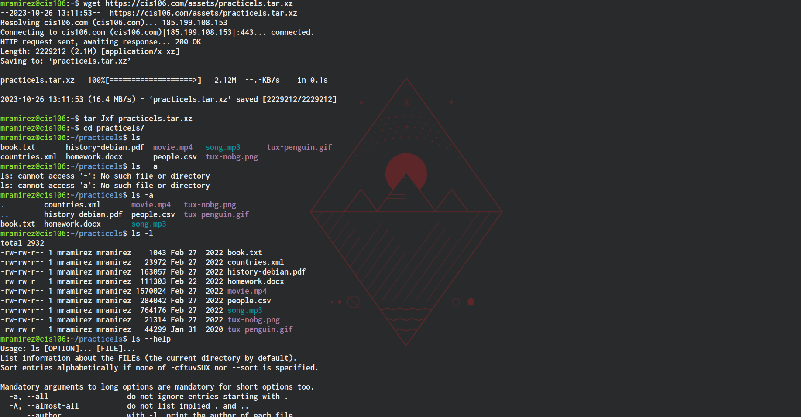
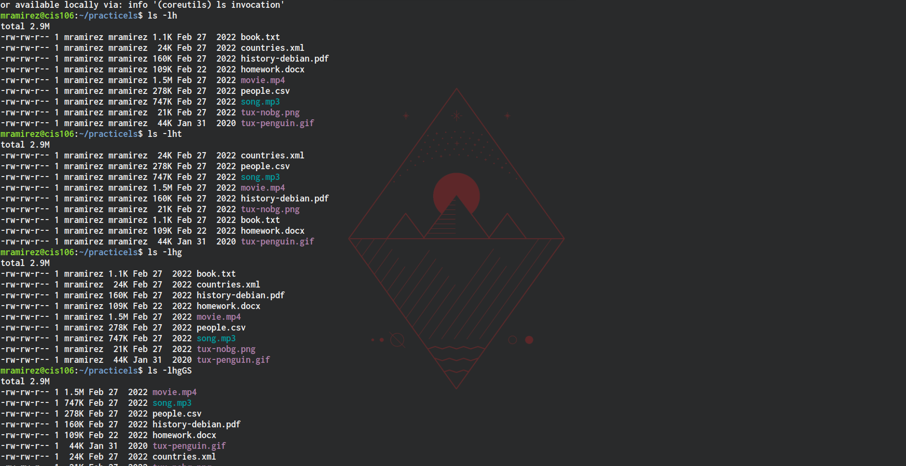
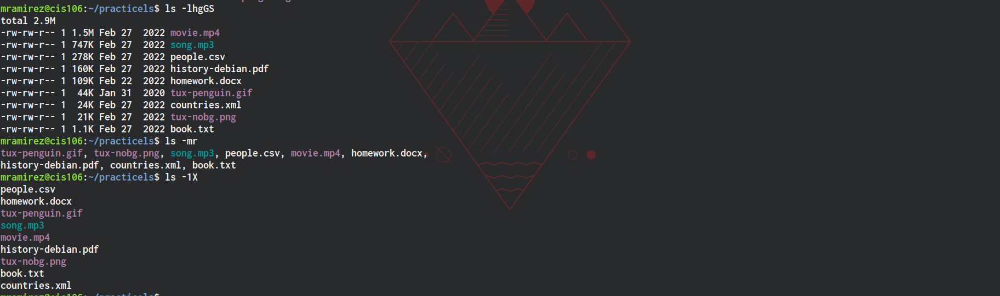
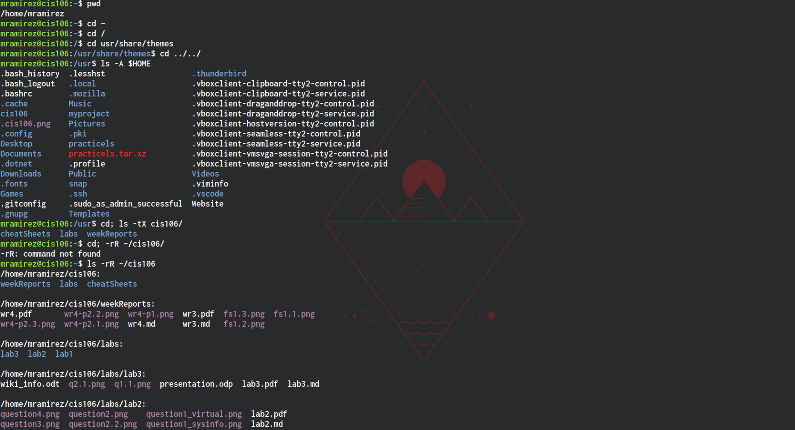
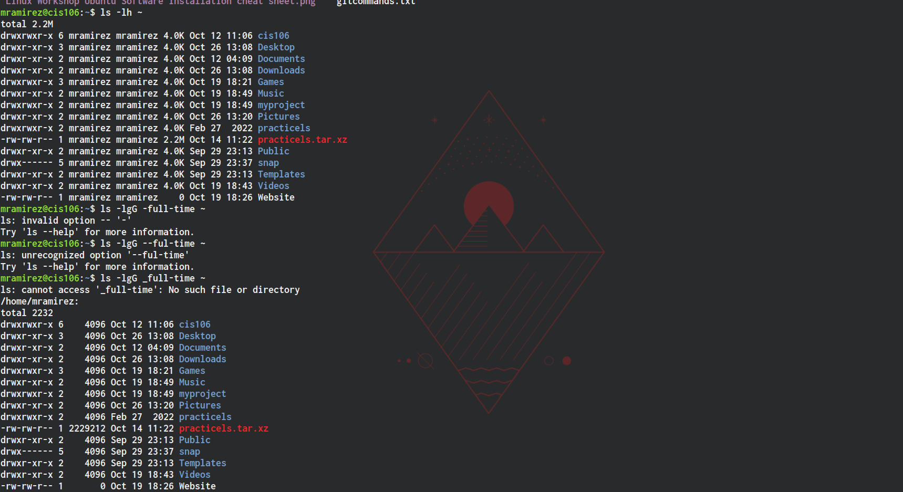
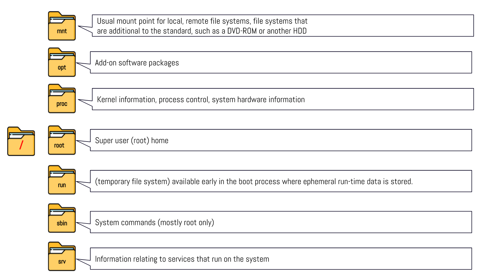
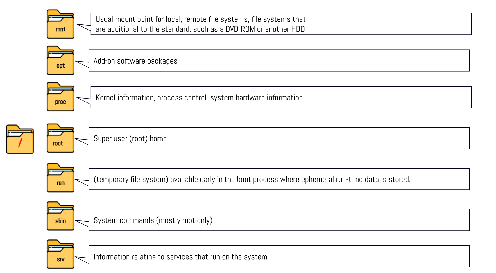
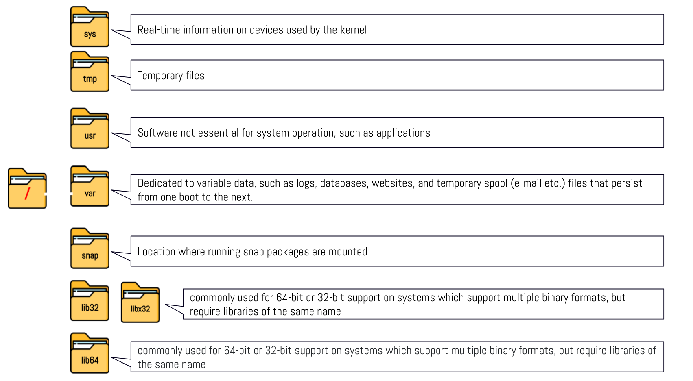

# Week Report 4 

## Practice from the presentation The Linux File system:
### Practice 1
 

### Practice 2
 
 
 

### Practice 3
 
 

## The Linux File system directories and their purpose:

 
 
 

## All the commands for navigating the filesystem

| Command | What it does                                 | Syntax | Example        |
| ------- | -------------------------------------------- | ------ | -------------- |
| pwd     | prints current directory                     | pwd    | 'pwd'          |
| cd      | used to change the current working directory | cd     | 'cd Downloads' |
| ls      | displays all files inside a given directory  | ls     | 'ls Downloads' |

## Basic terminology
* **File system** - The way files are stored and organized.
* **Current directory** - The directory you are at the moment or present working directory.
* **parent directory** - The directory in which you can move forward to a subdirectory or backwards to the previous directory
* **the difference between YOUR HOME directory and THE HOME directory** - The home directory is the user's directory; every user in the system will have a home directory. As for "your home" directory, it is the present user's directory.
* **pathname** - indicates the location of the file in the filesystem (like an address)
* **relative path** - the location of a file starting from the current working directory or a directory that is located inside the current working directory.
* **absolute path** - the location a file starting at the root of the file system.
