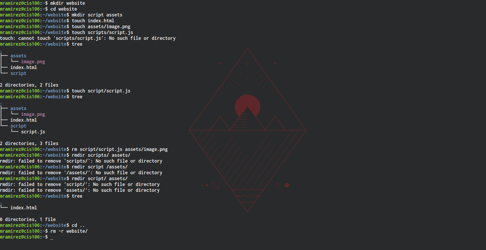
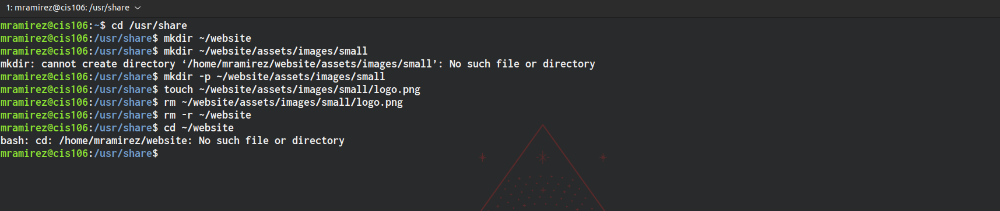
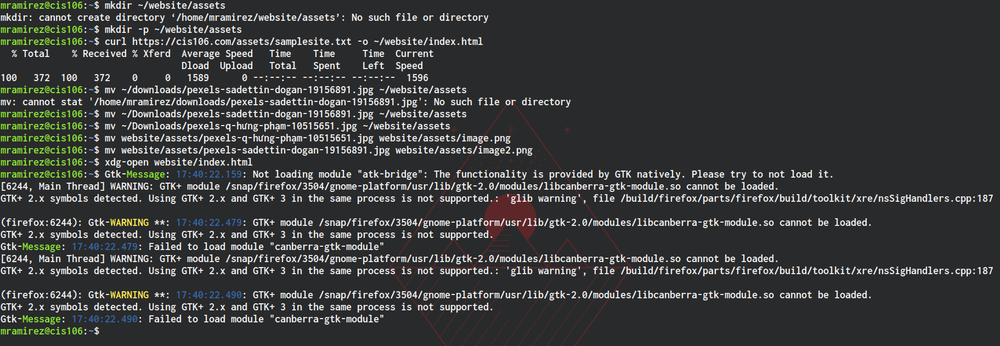

# Weekly Report 5

## What are command options?

* Command options are used to modify/enhance commands.

## What are command arguments?

* Command arguments are used to control which items the command acts on such as a file or directory.

## Which command is used for creating directories?

* The command used to create directories is 'mkdir'. It can be used to create a single or multiple directories.
  * Examples:
    * 'mkdir wallpapers'
    * 'mkdir wallpapers/new\ cars'
    * 'mkdir wallpapers/cars wallpapers/cities wallpapers/forest'

## How do you remove a file? 

* To remove a file you can use the following command: 'rm'
  * Example:
    * 'rm list.txt'

## How do you remove a directory and can you remove non-empty directories in Linux?

* To remove a directory you can use the following command: 'rm -r'.
  * Example: 'rm -r Downloads/games'
* In Linux and other Nix systems you cannot remove non-empty directories.

## MV and CP commands

* The 'mv' command allows you to move and rename directories.  
  * Examples:
    * To move a file:
      * 'mv Downloads/homework.pdf Documents/
    * To rename a file:
      * 'mv homework.docx cis106homework.docx'

* The 'cp' command allows you to copy files/directories from a source to a destination.
  * Examples:
    * To copy a file:
      * 'cp Downloads/wallpapers.zip Pictures/'
    * TO copy a directory:
      * 'cp -r ~/Downloads/wallpapers ~/Pictures/'

## Practice 1

## Practice 2

## Practice 3

## Practice 4

