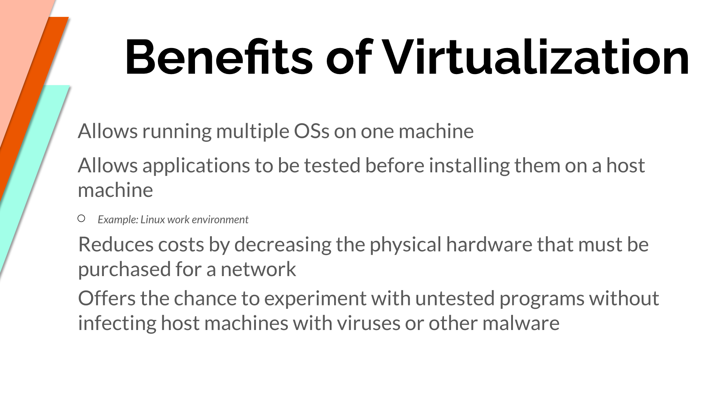
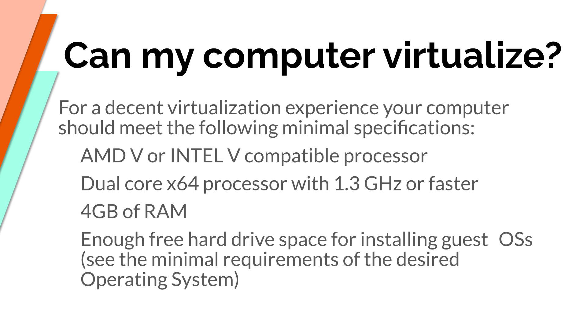
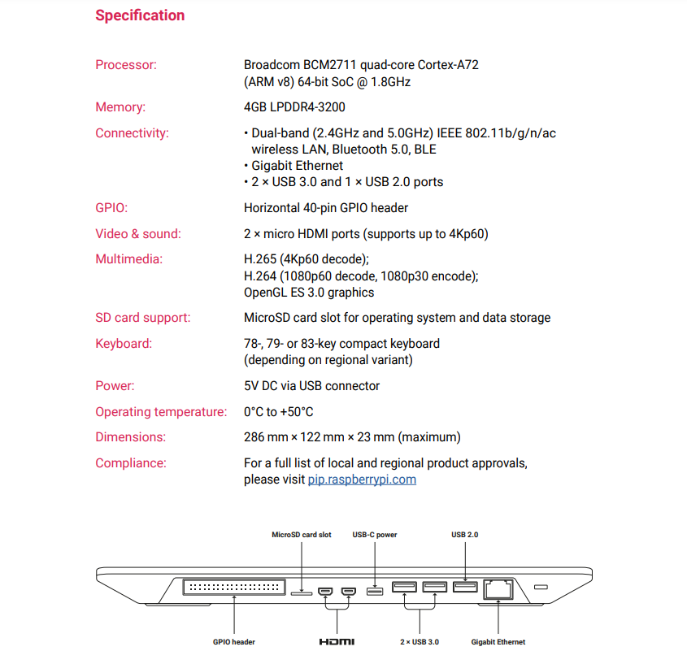

# Week Report 2

## Summary of Presentations

### What is virtualization?
* Replication of hardware to simulate a virtual machine inside a physical machine.
* There are two general types of virtualization:
  * Server-side virtualization
    * Server-side virtualization provides a virtual desktop to each user
      * Virtual Desktop Infrastructure (VDI)
  * Client-side virtualization
    * Software installed on a computer to manage virtual machines
    * Each virtual machine has its own operating system installed
    * For client-side virtualization, the computer needs:
      * A hypervisor
        * Software that allows the management of virtual machines
      * Hardware Support
        * Capable CPU
        * Enough RAM
        * Enough storage 
* Main difference between the two is where the virtualizing takes place.

### Installing Ubuntu in Virtualbox
Screenshots of installing ubuntu (no more than 5)

### What is the Raspberry Pi?

* The Raspberry Pi is a low cost, credit-card sized computer that plugs into a computer monitor or TV, and uses a standard keyboard and mouse. It's capable of doing everything you'd expect a desktop computer to do.

**Different models of the Raspberry Pi include:**
* Raspberry Pi 4 
* Raspberry Pi 3
* Raspberry Pi Zero W
* Raspberry Pi 3 A+
* Raspberry Pi 400

### Raspberry Pi 400 Specification
