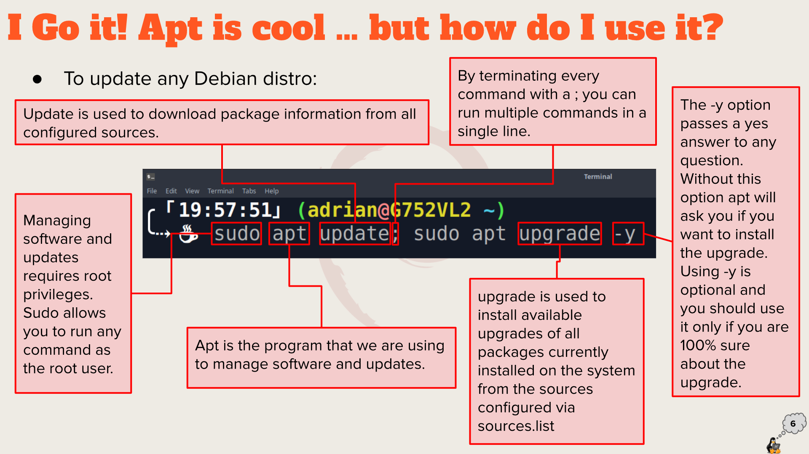

# Week Report 3

## Summary of Presentations 

## Exploring Desktop Environments

* Different Desktop Environments
  * GNOME
  * MATE
  * KDE
  * XFCE
  * LXDE

* GUI: A graphical user interface is a set of programs that allows a user to interact with the computer system via icons, windows, and various other visual elements.
* DE: A desktop environment is an implementation of the desktop metaphor made of a bundle of programs running on top of a computer operating system, which shares a common GUI, sometimes described as a graphical shell.
* Common elements of desktop environments
  * Icons
  * Widgets
  * Toolbars
  * Windows
  * Wallpapers

## The bash Shell

* What is a shell?
  * A program that provides interactive access to the Linux system. The shell is a command line interpreter that invokes kernel level commands.
    * Runs as a regular program and is normally started whenever a user logs in into a terminal.
* Different shells besides the bash shell
  * Tcsh Shell
  * Csh Shell
  * Ksh Shell
  * Zsh Shell
  * Fish Shell
### Bash Shortcuts
* **Ctrl + A** - go to the start of the command line.
* **Ctrl + E** - go to the end of the command line.
* **Ctrl + K** - delete from cursor to the end of the command line.
* **Ctrl + U** - delete from cursor to the start of the command line
* **Ctrl + F** - move forward one character
* **Ctrl + B** - move backward one character
* **Ctrl + L** - clear the screen
* **Ctrl + C** - terminate the command
* **Ctrl + Z** - suspend/stop the command

### List of basic commands
  * date - displays the current time and date
  * cal - displays a calendar of the current month
  * df - displays the current amount of free space on our disk drives
  * free - displays the amount of free memory
  * uname - displays information about your system
  * clear - clears the screen

## Managing Software

### Command for updating ubuntu
> 'sudo apt update; sudo apt upgrade -y'

### Command for installing software
> 'sudo apt install **"package name"**'
* examples:
  * 'sudo apt install firefox' 
  * 'sudo apt install firefox vlc'
### Command for removing software
> 'sudo apt remove **"package name"**'
* examples:
  * 'sudo apt remove firefox'
  * 'sudo apt remove firefox vlc'
### Command for searching for software
> 'apt search **"insert keyword"**'
* examples:
  * 'apt search "web browser"'

* **Package**: Archives that contain binaries of software, configuration files, and information about dependencies.
  * In Windows, these are commonly **.exe** files. 
* **Library**: Reusable code that can be used by more than one function or program.
* **Repository**: A large collection of software available for download.
  * Main - Canonical-supported free and open-source software.
  * Universe - Community-maintained free and open-source software.
  * Restricted - Proprietary drivers for devices.
  * Multiverse - Software restricted by copyright or legal issues.

