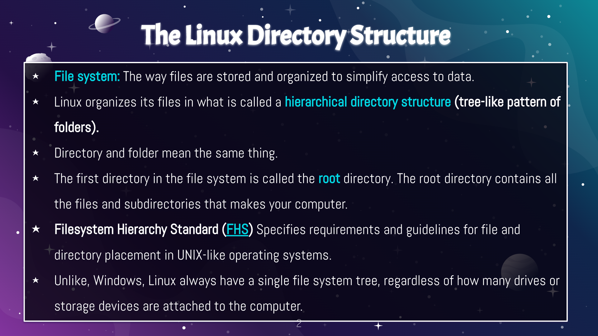
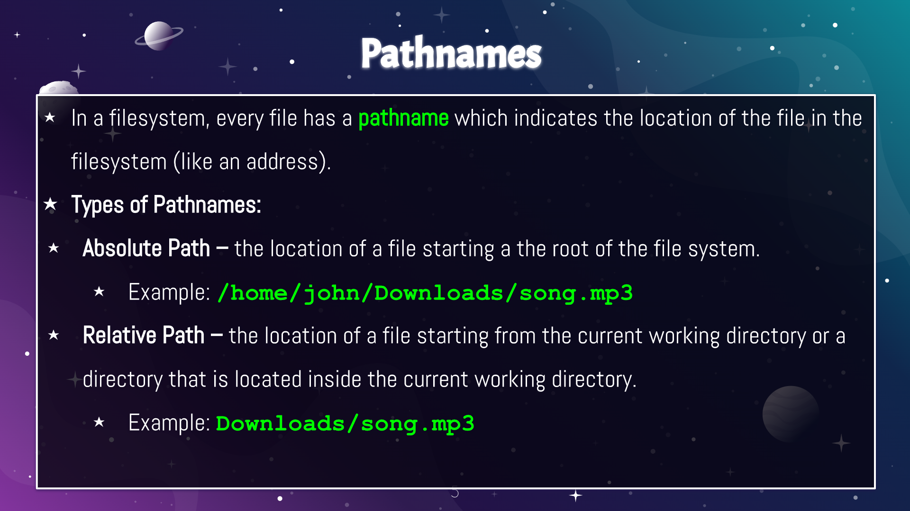
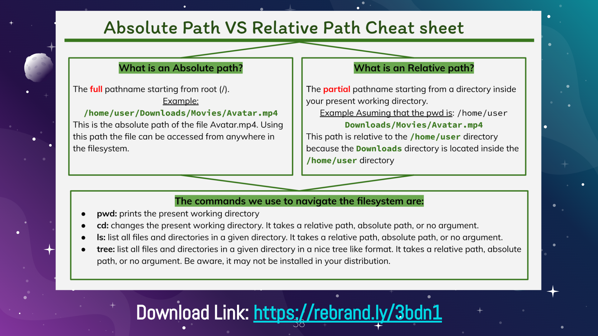
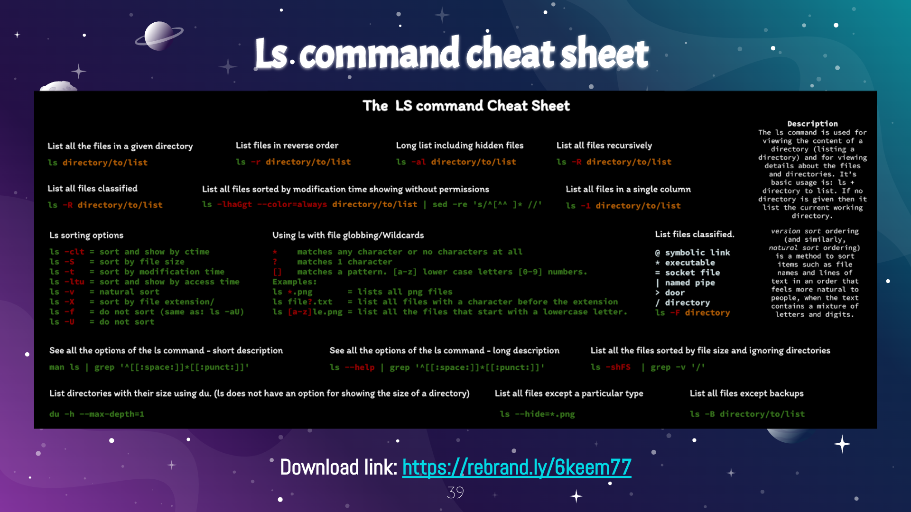

# Navigating the filesystem

# Table of Commands

| Commands | Description |
|----------|-------------|
| PWD command | Used for displaying the current working directory |
| CD command | Used for changing the current working directory. When no directory is given, cd changes the current working directory to the home directory of the current user. |
| LS command | Used for displaying all the files inside a given directory. When no directory is specified, ls displays the files in the current working directory. |

# Definitions

1. File system - The way files are stored and organized to simplify access to data.
2. Current directory - The directory where you are at the moment
3. Parent directory - The previous directory that was being worked on before the current directory
4. The phrase "your home directory" refers to your user's home directory. 
    * Example: /home/adrian is the home directory of the user adrian.
5. The phrase "the home directory" refers to the home directory located in the root.
    * Example: /home
6. Pathname - Indicated the location of the file in the filesystem (like an address)
7. Relative Path - The location of a file starting from the current working directory or a directory that is located inside the current working directory.
8. Absolute Path - The location of a file starting at the root of the file system.

# What is the right to repair movement and why does it matter?

* The right to repair movement believes in the concept that companies should make their schematics to smart devices accessible and access to any parts and tools that an individual or company may need to service the device. The movement is important as more companies have adopted practices that hinder or completely restrict the ability to repair or work on a device that the person has purchased. If you needed to repair your device, you would be forced to deal with the company directly and since that is the only way to fix your device, the company can charge any price that they want, which is usually really expensive. The right to repair movement would allow the option for 3rd party companies to provide the service for a lower price or allow the consumer to be able to repair the device themselves. 

# CHEAT SHEETS

