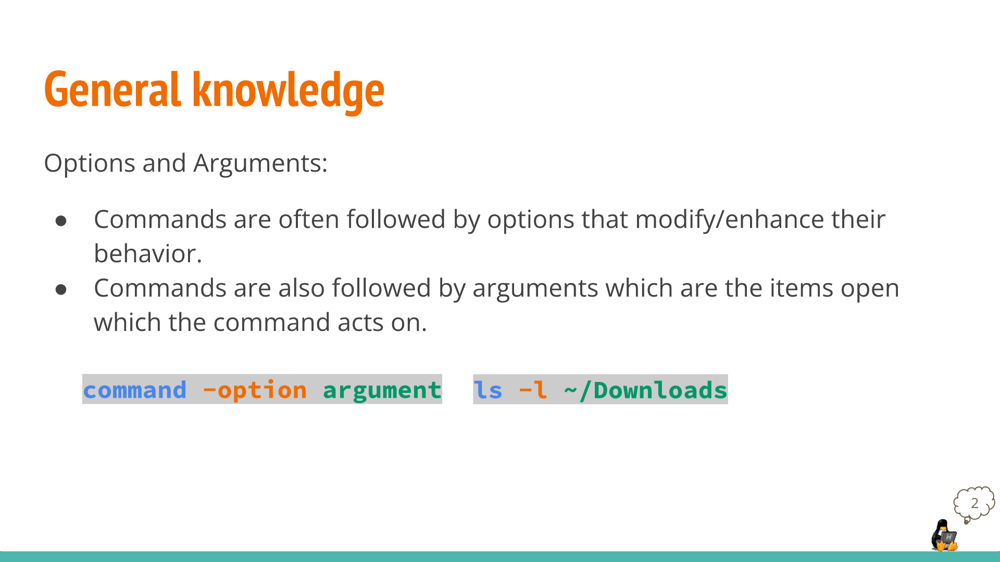
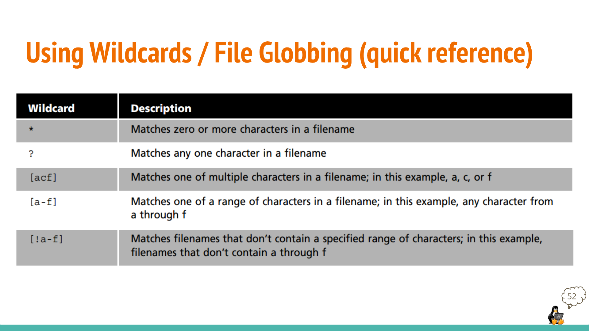

# Managing Files and Directories

## Commands

| Command | Definition | Usage | Examples |
|---------|------------|-------|---------|
|  mkdir  | creates a single directory or multiple directories | 'mkdir + the name of the directory' | 'mkdir wallpapers', 'mkdir ~/wallpapers/forest' |
|  touch  | updates any given file's timestamp, if the file does not exist, it creates it. | 'touch +  name of the file' | 'touch list', 'touch ~/Downloads/games.txt' |
|   rm    | removes files; can also remove directories | 'rm + name of file', 'rm -r + directory name or directory absolute path'   | 'rm list', 'rm -r Downloads/games' |
|  rmdir  | removes empty directories | 'rmdir + name of directory' | 'rmdir Downloads/games' |
|   mv    | moves and renames directories | 'mv + source + destination | 'mv Downloads/homework.pdf Documents/' |
|   cp    | copies files/directories from a source to a destination | For files: 'cp + files to copy + destination', For directories: 'cp -r + directory to copy + destination' | 'cp Downloads/wallpapers.zip Pictures/', 'cp -r ~/Downloads/wallpapers ~/Pictures/' |
|   ln    | used to create hard links or soft links | For hard link: 'ln file ~/Downloads/fileHL', For soft link: 'ln -s file fileSL' |         |
|   man   | used to access manual pages that are documentation files that describe Linux shell commands, executable programs, system calls, special files, etc... | 'man + command' | 'man passwd', 'man ls' |

# Wildcards

Examples for * wildcard:
* To list files that end in .txt regardless of the size of the file.
  * ls *.txt
* To list files that end in .pdf and .png
  * ls *.pdf *.png

Examples for ? wildcard:
* To list all hidden files in the current directory
  * ls ./.??*
* To list files that have two characters between letter g and d
  * ls g??d*
* To list files that have a 4 letter file extension
  * ls *.??? 

Examples for [] wildcard:
*  To match all files that have a range of letter after d:
   *  'ls d[a-z]*'

# Brace Expansion

* Brace expansion {}
  * Is not a wildcard
  * Feature of bash that allows you to generate arbitrary strings to use with commands.
    * Examples:
      * To create a whole directory structure in a single command: 
        * mkdir -p music/{rock,rap}/{mp3files,videos,oggfiles}/new{1..3}
      * To create N number of files:
        * touch website{1..5}.html
        * touch file{A..Z}.txt
        * touch file{001..10}.py
        * touch file{{a..z},{0..10}}.js
      * Remove multiple files in a single directory
        * rm -r {dir1,dir2,dir3,file.txt,file.py}